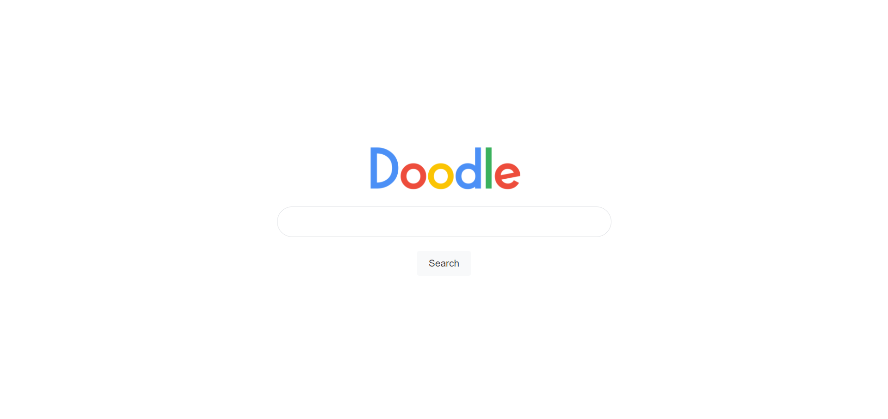
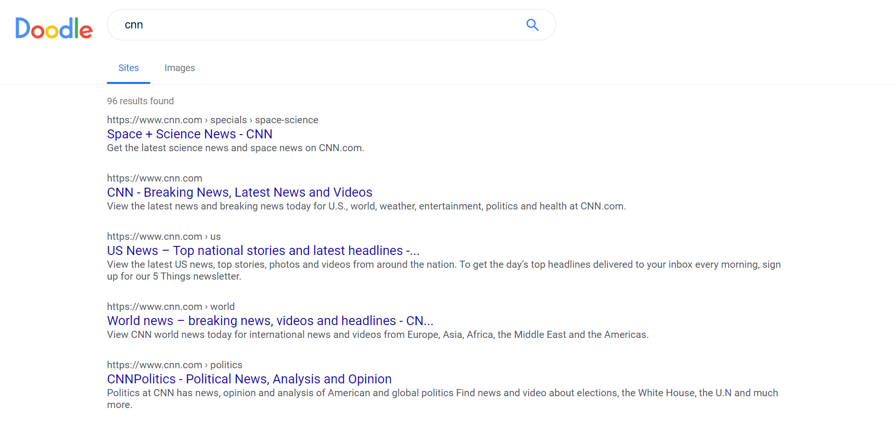
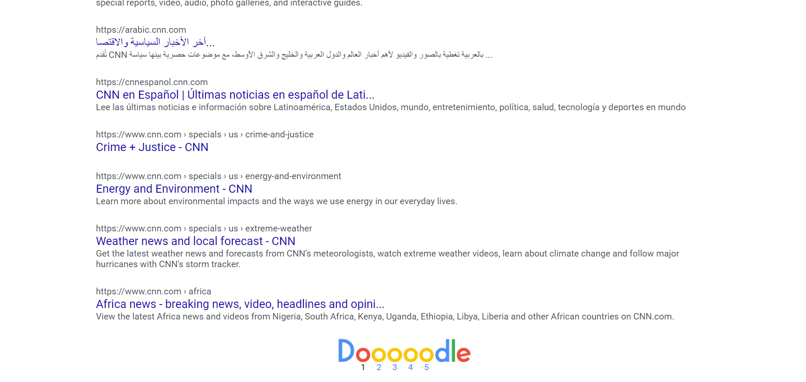

# Doodle
A simple Google clone made with PHP

## Installation & Deploy
Local: Clone the github repository into the `htdocs` folder supplied by XAMPP  
Cloud: Edit `config.php` to a remote sql connection and deploy to a free hosting service  

## Screenshots
Don't want to run a copy of Doodle? Enjoy some screenshots.

## Contributing
Like what you see? Consider contributing to Doodle!  
Planned features include:
* widgets (arithmetic, clock, timer)
* no results advice/warning
* better masonry layout for images